  

<h3 align="center">🚀 Full-Stack Web Developer | Open Source Enthusiast | Neura Global Intern</h3>

 

  
  &nbsp;
  
  &nbsp;
  
  &nbsp;
  
  &nbsp;
  
  &nbsp;
  

 

---

### 🔥 About Me
**My journey in the world of technology.**

Full stack developer passionate about building scalable web applications. Currently interning at Neura Global (a startup), working with React, Node.js, TypeScript, and PostgreSQL. Thrives on learning, collaborating with teams, and solving complex challenges.

- 📍 **Location:** Dharapuram, Tamil Nadu
- 📧 **Contact:** [tharunkumark42007@gmail.com](mailto:tharunkumark42007@gmail.com)
- 📞 **Phone:** +91 8760964830
- 🌟 **GeeksforGeeks:** Serving as Campus Mantri *(Jan 2026 – Jul 2026)*

---

### 💼 My Journey
**Professional experience and education history.**

#### 💼 Experience
- **Fullstack Development Intern @ Neura Global (Startup)** *(June 2026 - Present)*
  Developing and optimizing full-stack features using React, Node.js, and TypeScript. Collaborating with cross-functional teams to build responsive user interfaces and robust backend APIs in a fast-paced startup environment.

- **Software Development Intern @ Infosys Springboard** *(Nov 2025 - Jan 2026)*
  Completed Infosys Springboard 6.0 program. Developed "StarWall: Employee Recognition Dashboard" project. Learned enterprise development practices, debugging techniques, and collaborative coding in a real production environment.

#### 🎓 Education
- **Bachelor of Technology - Information Technology** @ VSB Engineering College, Karur, Tamil Nadu *(2024 - 2028)*
  *Expected Graduation: May 2028 | CGPA: 8.5 / 10*
- **Higher Secondary (12th Grade)** @ Sindhu Matriculation Higher Secondary School, Tamil Nadu *(2023 - 2024)*
  *Score: 84.66%*

---

### 🛠️ Technical Arsenal
**The tools and languages I use to bring ideas to life.**

**Languages** 

**Frontend** 

**Backend** 

**Databases** 

**Tools & Platforms** 

---

### 🚀 Projects
**Real-world applications built with cutting-edge tech.**

- 🎓 **[Campus Connect — College Placement Cell Platform](https://campusconnect-yg4h.onrender.com/)** *(June 2026)* — [GitHub Repo](https://github.com/Tharun4743/CampusConnect)
  `React · TypeScript · Tailwind CSS · Node.js · Express · Supabase · Socket.IO`
  Premium, enterprise-grade placement management platform designed to automate TPO workflows, facilitate seamless recruiter engagement, and help students transition smoothly into their careers.

- 💬 **[Techy Tharun's Chatbox — AI Assistant](https://tharunchatbox.onrender.com)** *(Feb – Apr 2026)* — [GitHub Repo](https://github.com/Tharun4743/Tharun-s-Chatbox)
  `Next.js 15 · TypeScript · Tailwind CSS · Prisma · Neon PostgreSQL · GPT-4o`
  A high-performance, premium AI assistant powered by GPT-4o. Featuring a sleek, humanized interface and optimized for extreme speed and near-zero latency streaming.

- 🧠 **[Aura — AI Unified Retrieval Assistant](https://github.com/Tharun4743/SIH25231)** *(2026)*
  `React · Spring Boot · Java · SQLite · ChromaDB · Ollama · Electron`
  100% Offline Multimodal Retrieval-Augmented Generation (RAG) System developed for resource-constrained environments. Features local document processing, multimodal vision indexing, and voice transcription.

- 🪖 **[Smart Helmet IoT Safety System](https://github.com/Tharun4743/AGILE-INNOVATORS-smart-helmet-)** *(Sep – Oct 2025)*
  `Arduino · C · RF 433MHz · IoT · Embedded Systems`
  An intelligent IoT helmet system that proactively prevents accidents by monitoring helmet wear, alcohol levels, and drowsiness — disabling bike ignition on unsafe conditions via RF communication. Smart India Hackathon 2025 Submission.

---

### 🏆 Achievements
**Recognition for excellence and innovation.**

- 🥇 **[Code Thugs 2k26] Hackathon Winner** *(2026)*: Secured 1st place nationally for a Real-Time Collaborative Code Editor with multi-user synchronization and conflict resolution. Recognized for innovative system design. Prize: ₹5,000 cash award.
- 🚀 **[SIH 2025] Smart India Hackathon 2025 — Internal Hackathon Top 50** *(2025)*: Selected in the top 50 out of 300+ submissions during the SIH internal hackathon phase. Led the full-stack development for an IoT-based rider safety system.
- 🔬 **[India Innovates] India Innovates 2026 — Finals Track** *(2026)*: Advanced to the finals track after two rigorous selection rounds. Demonstrated capability to develop production-grade, scalable solutions.
- 🌟 **[GeeksforGeeks] Campus Mantri** *(2026)*: Served as Student Ambassador from January 2026 to July 2026. Organized tech workshops and events to build a strong coding culture on campus.
- 🎯 **[Symposium Event] Fun Quest Event Coordination** *(2026)*: Led technical coordination and execution of a non-technical symposium event. Managed 150+ participants across two slots. Achieved 9.8 / 10 average participant feedback rating.

---

### 📜 Certifications Journey
**Continuous learning and professional growth.**

- 🎓 **[Infosys Internship Completion Certificate](https://drive.google.com/file/d/1Q9M6APOGYKO0_jYrKBAO4fAwTFEZJigy/view?usp=drive_link)** — *Infosys Springboard (2024)*
- 📊 **[Tata - GenAI Powered Data Analytics Job Simulation](https://www.theforage.com/completion-certificates/ifobHAoMjQs9s6bKS/gMTdCXwDdLYoXZ3wG_ifobHAoMjQs9s6bKS_RxeDd9TgPqW92wdDx_1750820862922_completion_certificate.pdf)** — *Forage (Jun 2025)*
- 💻 **[Dynamic Programming Camp Participation Certificate](https://d3uam8jk4sa4y4.cloudfront.net/static/certificates/Dynamic_Programming_camp/tharunkumar-k.png)** — *AlgoUniversity (May 2026)*
- 🛡️ **[Responsible AI: Applying AI Principles with Google Cloud](https://www.skills.google/public_profiles/180f5b3d-e9b7-448b-8a76-0347666076bb/badges/17907581?utm_medium=social&utm_source=linkedin&utm_campaign=ql-social-share)** — *Google Cloud (Aug 2025)*
- 🤖 **[Prompt Design in Agent Platform](https://www.skills.google/public_profiles/180f5b3d-e9b7-448b-8a76-0347666076bb/badges/16663518?utm_medium=social&utm_source=linkedin&utm_campaign=ql-social-share)** — *Google (Jun 2025)*
- 🧠 **[Introduction to Large Language Models](https://www.skills.google/public_profiles/180f5b3d-e9b7-448b-8a76-0347666076bb/badges/17907465?utm_medium=social&utm_source=linkedin&utm_campaign=ql-social-share)** — *Google (Aug 2025)*
- ✨ **[Prompt Design in Vertex AI Skill Badge](https://www.skills.google/public_profiles/180f5b3d-e9b7-448b-8a76-0347666076bb)** — *Google (Jun 2025)*
- 🌐 **[Introduction to IoT](https://www.credly.com/badges/e0e38f42-909d-46a0-8a23-4cbb658ceb2b/linked_in_profile)** — *Cisco (Nov 2025)*
- ☁️ **[Salesforce Administrator Explorer](https://drive.google.com/file/d/1IgkTkYQ-dfhashY-7-R6soyY7YQhw4zI/view?usp=drive_link)** — *Trailhead by Salesforce (Aug 2025)*
- 🏆 **TCS iON Career Edge — Young Professional** — *TCS iON (2025)*
- 🐍 **Python Foundation** — *2024*
- 🔌 **Introduction to IoT and Digital Transformation** — *Certification (2024)*

---

### 📊 GitHub Analytics
**Real-time repository statistics and contributions activity tracker.**

  
  &nbsp;&nbsp;
  

  

---

### 🤝 Let's Connect
**I'm always open to discussing new projects, creative ideas or opportunities to be part of your vision.**

- 📧 **Drop me a message:** [tharunkumark42007@gmail.com](mailto:tharunkumark42007@gmail.com)
- 📞 **Give me a call:** +91 8760964830
- 🔗 **LinkedIn:** [tharunkumark4743](https://www.linkedin.com/in/tharunkumark4743/)
- 👨‍💻 **GitHub:** [Tharun4743](https://github.com/Tharun4743)
- 🚀 **LeetCode:** [Tharunkumar__K](https://leetcode.com/u/Tharunkumar__K/)
- 💻 **GeeksForGeeks:** [tharunkumark4743](https://www.geeksforgeeks.org/profile/tharunkumark4743)
