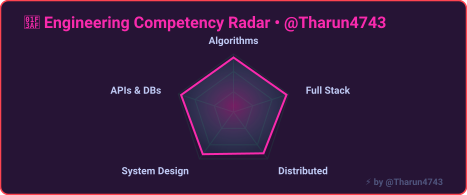
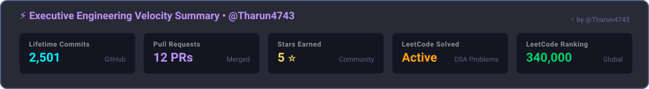
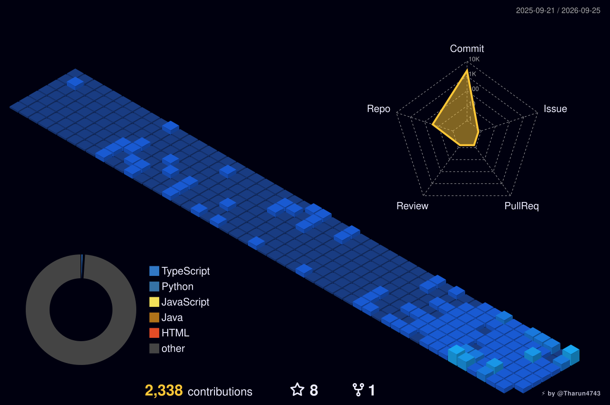
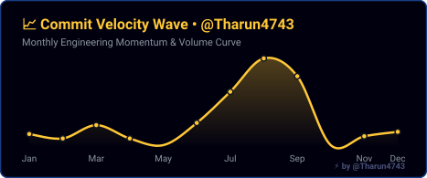
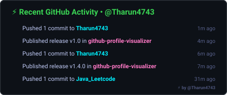
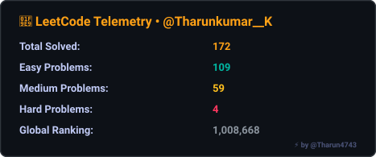
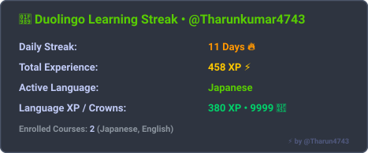

# Hi, I'm Tharunkumar K 👋

### Full Stack Developer | AI Application Developer

  
  

B.Tech Information Technology student building production-grade full-stack applications, distributed systems, and AI-powered developer tools.

I specialize in architecting high-reliability software ecosystems, isolated compiler sandboxes, real-time WebRTC/WebSocket communication channels, and scalable database schemas.

- 🎓 **Education:** B.Tech Information Technology — VSB Engineering College (**CGPA: 8.5 / 10**)
- 🎯 **Target Roles:** Software Development Engineer (SDE I), Full Stack Engineer, Backend Systems Engineer
- 🧠 **Core Competencies:** Data Structures & Algorithms, Object-Oriented Design, System Design, RESTful APIs, Concurrency & State Machines
- 📚 **Currently learning:** Distributed System Design & Cloud Native Architecture
- 🌐 **Portfolio:** [tharunkumark4743.netlify.app](https://tharunkumark4743.netlify.app/)

---

## 🏆 Achievements

- 🥇 **Code Thugs 2K26** — 1st Place / National Winner
- 🇮🇳 **India Innovates 2026** — National Finalist
- 🏆 **Odoo × NMIT 2026** — National Finalist
- 🚀 **Smart India Hackathon** — National Finalist
- 🌟 **SIH 2025 & 2026 Top 50**
- 👨‍💻 **IT Department Student Coordinator** — VSB Engineering College
- 🎓 **GeeksforGeeks Campus Mantri** — 2026

---

## 💻 Featured Production Projects & Developer Tools

*Selected projects demonstrating full-stack engineering, real-world adoption, and measurable architectural impact.*

### ⚡ [GitHub Profile Visualizer](https://github.com/marketplace/actions/github-profile-visualizer)
**All-in-One Multi-Platform Developer Activity & 3D Isometric Telemetry Suite (GitHub Action & CLI)**

Next-generation developer telemetry visualizer generating dynamic 3D isometric city skylines, real-time activity streams, executive velocity banners, and multi-metric coding competency cards for GitHub profiles.

* 🚀 **GitHub Marketplace Action:** Published, reusable CI/CD Action (`uses: Tharun4743/github-profile-visualizer@v1`) powering dynamic profile automation across developer communities.
* 🏙️ **12-in-1 Complete Visualizer Suite:** Generates 3D Contribution City, Executive Summary Banner, Developer Achievements & Medals, Commit Velocity Wave, Engineering Competency Radar, Productive Coding Habits, Language Matrix, Live Event Timeline, LeetCode, GeeksforGeeks, HackerRank, and Duolingo Telemetry in a single execution pass.
* 🎨 **Universal Theming & Glassmorphism:** 10 curated color themes (Cyberpunk, Tokyo Night, Dracula, Nord, Matrix, Synthwave, Monokai, Sunset, Emerald, GitHub Dark), user-defined 5-color palettes, configurable border radius, and transparent glassmorphism rendering.
* 📐 **Pure SVG Mathematical Projection Engine:** Zero headless-browser dependencies (no Puppeteer/Playwright overhead); renders 365 days of contribution depth using deterministic isometric math (`isoX = (x - y) * cos(30°)`, `isoY = (x + y) * sin(30°) - height`) compiled into an ultra-fast Node.js bundle.

**Tech Stack:** Node.js 20+ · SVG Vector Math Engine · GitHub GraphQL & REST APIs · LeetCode Public GraphQL · @vercel/ncc  
🔗 [GitHub Marketplace Listing](https://github.com/marketplace/actions/github-profile-visualizer) · [Source Repository](https://github.com/Tharun4743/github-profile-visualizer) · [Releases & Changelog](https://github.com/Tharun4743/github-profile-visualizer/releases)

---

### 🏛️ [VSBEC IT Vault](https://github.com/Tharun4743/taskmanager)
**Enterprise Institutional Governance, Streak Tracking & Sandboxed Assessment Engine**

Role-based academic governance and technical assessment ecosystem engineered for the Department of Information Technology.

* 👥 **Real-World Campus Adoption:** Actively adopted and used daily by **365+ enrolled students** at VSB Engineering College.
* 🔐 **Isolated Compiler Sandbox:** Multi-language execution runtime (**C, C++, Java 17, Python 3**) with isolated child-process jails, execution timeout traps, and automated server-side hidden test case evaluation.
* ⚡ **Relational Data Architecture:** Normalized PostgreSQL database with 13 relational schemas, foreign-key integrity constraints, and optimized indexed queries.
* 📊 **Algorithmic Momentum Schedulers:** Automated nightly background daemons polling LeetCode GraphQL and GitHub REST APIs to track student solve velocity and streaks.
* 🛡️ **3-Tier Audit FSM & Anti-Cheat:** Deterministic 3-tier approval chain (Coordinator → Advisor → HOD) with verifiable submission audit logs, fullscreen lockdown, and PIP webcam assessment proctoring.

**Tech Stack:** React 19 · TypeScript 5.8 · Vite 6 · Tailwind CSS · Node.js 20+ · Express · PostgreSQL 14 (13 Relational Tables) · Monaco Editor · Supabase · Cloudinary  
🔗 [Live Production Demo](https://it-taskmanager.vercel.app/) · [GitHub Repository](https://github.com/Tharun4743/taskmanager)

---

### ⚡ [GOAT Code Editor](https://github.com/Tharun4743/GOAT-CE)
**Real-Time Collaborative Cloud IDE with Zero-SDK WebRTC Voice Mesh & Compiler**

High-performance in-browser collaborative engineering workspace unifying multi-user operational sync, encrypted audio communication, and sandboxed compilation.

* 🏆 **Code Thugs 2K26 1st Place Winner:** Awarded 1st place in state-level hackathon for real-time systems engineering.
* 🎙️ **Pure WebRTC Audio Mesh (Zero SDKs):** Custom peer-to-peer audio mesh handling SDP handshakes, ICE candidates, hardware echo cancellation, and Web Audio `AnalyserNode` Voice Activity Detection (VAD) without paid 3rd-party SDK dependencies.
* ⚡ **Sub-Pixel Operational Diff Streaming:** Socket.IO pipeline streaming operational transformations, remote colored carets, and live user selection across a native Monaco (VS Code kernel) editor.
* 🚀 **Instant <2s Workspace Provisioning:** Dual-persistence architecture utilizing in-memory room state with PostgreSQL persistence, spinning up active collaborative workspaces in under 2 seconds.
* ⚙️ **Multi-Language Sandboxed Execution:** In-browser execution engine supporting JavaScript, TypeScript, Python, Java, C++, and Go via Piston API v2.

**Tech Stack:** React 19.2 · TypeScript · Node.js · Express · Socket.IO 4.8 · Pure WebRTC · Monaco Editor · PostgreSQL 16 · Piston API  
🔗 [Live Production Demo](https://goatcode-editor.onrender.com) · [GitHub Repository](https://github.com/Tharun4743/GOAT-CE)

---

### 🎓 [CampusConnect](https://github.com/Tharun4743/CampusConnect)
**Automated Campus Placement Governance & Corporate Recruitment Ecosystem**

Full-stack recruitment workflow engine and placement governance platform built for collegiate Training & Placement Offices (TPO).

* 📈 **Live 5-State WebSocket Recruitment Funnel:** Bi-directional Socket.IO pipeline (Applied → Shortlisted → Technical Rounds → Interviewing → Offered) eliminating manual email lag and status confusion.
* 🧠 **Google Gemini AI Resume Intelligence:** Semantic analysis engine parsing student resumes against recruiter job specifications, computing fit scorecards and actionable skill-gap recommendations.
* 🚪 **Automated Database Guardrails:** Database-enforced CGPA and active backlog eligibility gating, eliminating manual eligibility verification errors.
* 📦 **Cloud Document Vault & Transactional Email:** Cloudinary CDN integration for secure academic transcripts and multi-provider transactional email delivery supporting Nodemailer SMTP, SendGrid, and Resend.

**Tech Stack:** React 19 · Vite 6.2 · TypeScript · Node.js 20+ · Express · Socket.IO · Supabase (PostgreSQL 15) · Google Gemini AI · Cloudinary CDN  
🔗 [Live Production Demo](https://campusconnect-yg4h.onrender.com) · [GitHub Repository](https://github.com/Tharun4743/CampusConnect)

---

### 🧠 [Aura — AI Unified Retrieval Assistant (SIH25231)](https://github.com/Tharun4743/SIH25231)
**Offline Multimodal RAG Engine & Local AI Assistant (Desktop & Web)**

Air-gapped, privacy-first local multimodal Retrieval-Augmented Generation (RAG) system engineered for high-security, low-bandwidth, and confidential enterprise environments.

* 🔒 **100% Offline Air-Gapped Inference:** Eliminates cloud data leaks and recurring API costs by executing quantized local LLMs (`llama3`) and dense embeddings (`nomic-embed-text`) entirely on-device via Ollama.
* 📄 **Local Document Pipeline & Vector Search:** Ingests and processes complex PDFs locally using Apache PDFBox, chunking text and performing low-latency semantic vector similarity search stored in an embedded SQLite database.
* ⚡ **High-Throughput Spring Boot Backend:** Powered by Java 17 and Spring Boot 3 with JPA, HikariCP connection pooling, and bi-directional WebSocket streaming (`/ws/chat`) for real-time token-by-token answer generation.
* 💻 **Dual Distribution Architecture:** Single codebase supporting both a fast React + Vite web interface (with reverse proxy configurations) and a standalone cross-platform Electron desktop application bundling a self-contained JRE.

**Tech Stack:** Java (JDK 17) · Spring Boot 3 · React · Vite · Electron · SQLite · Apache PDFBox · Ollama (LLaMA 3, Nomic Embed) · WebSockets  
🔗 [GitHub Repository](https://github.com/Tharun4743/SIH25231)

---

### 🛡️ [Smart Helmet IoT Safety System](https://github.com/Tharun4743/AGILE-INNOVATORS-smart-helmet-)
**Dual-Unit Embedded Rider Safety System with Wireless RF Ignition Interlock**

Embedded vehicle safety platform engineered to proactively eliminate motorcycle accidents via real-time biometric and environmental telemetry.

* 🚀 **Smart India Hackathon 2025 Top 50 Nominee:** Selected as Top 50 out of 300+ campus engineering teams and officially nominated on the central SIH portal.
* 📡 **Dual-Unit Low-Latency RF Architecture:** High-reliability 433MHz wireless telemetry linking sensor-equipped helmet transmitter with motorcycle ignition receiver.
* 🚫 **Sub-500ms Alcohol Interlock:** Sensitive MQ-3 breath alcohol sensor continuously analyzing rider breath, cutting bike ignition within 500ms upon detecting intoxication.
* 👁️ **IR Wear & Drowsiness Monitoring:** Optical IR proximity sensor enforcing helmet compliance, paired with an eye-blink sensor tracking eyelid closure rates to wake riders during micro-sleep episodes.
* ⏱️ **5-Second RF Fail-Safe Watchdog:** Hardware interrupt watchdog automatically isolating engine ignition if wireless telemetry is compromised.

**Tech Stack:** Arduino Core (C/C++) · RF 433MHz Telemetry · MQ-3 Alcohol Sensor · Optical IR Sensors · Relay Control Modules  
🔗 [GitHub Repository](https://github.com/Tharun4743/AGILE-INNOVATORS-smart-helmet-) · [Project Dossier](https://drive.google.com/drive/folders/1kYhyoOx9-Tr4WyOJkmUz7K4PDDpmaHEr?usp=drive_link)

---

## 💼 Industry Experience

### 🚗 Enterprise Systems Intern — Pega Systems
**Jul 2026 – Aug 2026**

- Engineered **[Vehicle Service Management](https://github.com/Tharun4743/Vehicle-Service)** automotive case lifecycle automation platform on Pega Infinity '24.1 (Pega Next-Gen Innovators Program).
- Built multi-stage case flows (`Intake` → `Diagnostic Inspection` → `Cost Estimation` → `Customer Approval SLA` → `Technician Repair` → `Automated Invoicing`).
- Configured automated SLA Goal and Deadline escalation timers, declarative pricing rules, and skill-based work queue routing (`HeavyVehicleQueue` vs. `LightVehicleQueue`).

### 🚀 Full Stack Development Intern — Neura Global
**Jun 2026 – Jul 2026**

- Architected and deployed **CampusConnect**, an enterprise placement governance and corporate recruitment platform.
- Engineered high-concurrency RESTful APIs and real-time Socket.IO pipelines backed by Supabase (PostgreSQL 15).
- Integrated Google Gemini AI for semantic resume scoring against recruiter requirements, generating skill-gap recommendations.
- Optimized query execution plans and frontend bundle sizes, significantly improving page load performance.

### 💻 Software Development Intern — Infosys Springboard
**Nov 2025 – Jan 2026**

- Graduated from **Infosys Springboard 6.0** enterprise software engineering curriculum with top distinction.
- Developed **StarWall**, a full-stack peer recognition and analytics portal applying industry architectural design patterns.

---

## 🛠️ Technical Competencies & Tech Stack

  

 

### Languages

### Frontend

### Backend

### Databases & Storage

### AI & Developer Tools

### Tools & Platforms

---

## 📖 Currently Learning (SDE Interview Focus)

- 🧠 **Data Structures & Algorithms** (advanced graph theory, dynamic programming, algorithmic optimization)
- 📐 **Low-Level & High-Level System Design** (distributed caches, database sharding, microservice patterns)
- 🏗️ **Backend Concurrency & Architecture** (event-driven microservices, connection pooling, rate limiters)
- ☁️ **Cloud Native Infrastructure** (CI/CD pipelines, container orchestration, edge deployments)
- 🤖 **AI Application Development** (RAG pipelines, semantic embeddings, vector search)

---

## 🏅 Certifications & Badges

- 🏅 [Infosys Springboard Internship Completion](https://drive.google.com/drive/folders/1zdLQ8EoEC8X73fFAJjSJr-Ros_xckIyW)
- 🏅 [Tata — GenAI Powered Data Analytics Job Simulation](https://drive.google.com/drive/folders/1zdLQ8EoEC8X73fFAJjSJr-Ros_xckIyW)
- 🏅 [TCS iON Career Edge — Young Professional](https://drive.google.com/drive/folders/1zdLQ8EoEC8X73fFAJjSJr-Ros_xckIyW)
- 🏅 [Google Cloud — Responsible AI](https://drive.google.com/drive/folders/1zdLQ8EoEC8X73fFAJjSJr-Ros_xckIyW)
- 🏅 [Google — Introduction to Large Language Models](https://drive.google.com/drive/folders/1zdLQ8EoEC8X73fFAJjSJr-Ros_xckIyW)
- 🏅 [Google — Prompt Design](https://drive.google.com/drive/folders/1zdLQ8EoEC8X73fFAJjSJr-Ros_xckIyW)
- 🏅 [Cisco — Introduction to IoT](https://drive.google.com/drive/folders/1zdLQ8EoEC8X73fFAJjSJr-Ros_xckIyW)
- 🏅 [Salesforce — Administrator Explorer](https://drive.google.com/drive/folders/1zdLQ8EoEC8X73fFAJjSJr-Ros_xckIyW)

---

## 🌐 Coding & Professional Profiles

---

## 📊 GitHub Analytics & Engineering Velocity

<!-- Executive Summary Banner -->

  

<!-- 3D Contribution City (High-Fidelity Yoshi Engine) -->

  

<!-- Complete Multi-Metric Visualizer Suite -->
<table border="0" cellpadding="0" cellspacing="4" align="center" width="100%">
  <tr>
    <td align="center" width="50%" valign="middle">
      
    </td>
    <td align="center" width="50%" valign="middle">
      
    </td>
  </tr>
  <tr>
    <td align="center" width="50%" valign="middle">
      
    </td>
    <td align="center" width="50%" valign="middle">
      
    </td>
  </tr>
  <tr>
    <td align="center" width="50%" valign="middle">
      
    </td>
    <td align="center" width="50%" valign="middle">
      
    </td>
  </tr>
  <tr>
    <td align="center" width="50%" valign="middle">
      
    </td>
    <td align="center" width="50%" valign="middle">
      
    </td>
  </tr>
</table>

  ⚡ 100% Self-Contained Telemetry powered by <a href="https://github.com/marketplace/actions/github-profile-visualizer"><b>GitHub Profile Visualizer</b></a> by <a href="https://github.com/Tharun4743"><b>@Tharun4743</b></a>

---

## 📬 Let's Connect

I'm open to software engineering opportunities, technical collaborations, and interesting projects.

- 📧 **Email:** [tharunkumark42007@gmail.com](mailto:tharunkumark42007@gmail.com)
- 💼 **LinkedIn:** [tharunkumark4743](https://www.linkedin.com/in/tharunkumark4743)
- 💻 **GitHub:** [Tharun4743](https://github.com/Tharun4743)
- 🧩 **LeetCode:** [Tharunkumar__K](https://leetcode.com/u/Tharunkumar__K/)
- 🦉 **Duolingo:** [Tharunkumar4743](https://www.duolingo.com/profile/Tharunkumar4743)
- 🌐 **Portfolio:** [tharunkumark4743.netlify.app](https://tharunkumark4743.netlify.app/)

---

### 🐍 365-Day Contribution Activity Snake

<picture>
  <source media="(prefers-color-scheme: dark)" srcset="assets/github-contribution-grid-snake-dark.svg">
  <source media="(prefers-color-scheme: light)" srcset="assets/github-contribution-grid-snake.svg">
  
</picture>

  

