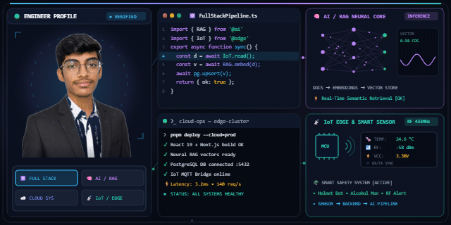
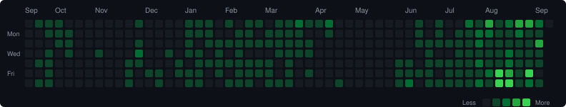
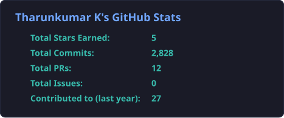
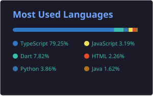

# Tharunkumar K

### Full Stack Developer · AI Builder · IoT Engineer

  Building <b>intelligent software solutions</b> spanning full-stack web applications, AI/RAG workflows, and IoT safety systems.

  📍 Dharapuram, Tamil Nadu, India &nbsp;•&nbsp; 🎓 B.Tech IT @ VSB Engineering College <i>(CGPA: 8.5/10)</i>

 

---

## 👨‍💻 About Me

I am a software engineer focused on building end-to-end applications that bridge intuitive user interfaces with robust distributed backends, generative AI pipelines, and embedded hardware.

* 🎓 **Education**: B.Tech in Information Technology at **VSB Engineering College** (2024 – 2028, **CGPA: 8.5/10**)
* 💼 **Work Experience**: Fullstack Development Intern at **Neura Global** & Software Development Intern at **Infosys Springboard**
* 🏆 **Hackathons**: **1st Place Winner** at *Code Thugs 2K26* & **Top 50 / 300+ Teams** in *Smart India Hackathon 2025*
* 👨‍💼 **Leadership**: Department Student Coordinator & SIH 2026 Coordinator for the IT Department
* 🔭 **Current Focus**: Real-time collaborative systems, local multimodal RAG architectures, and edge IoT devices

---

## 🛠️ Technical Skills

| Domain | Technologies |
| :--- | :--- |
| **Languages** | TypeScript, JavaScript, Python, Java, C, C++, SQL |
| **Frontend** | React 19, Next.js 15, Tailwind CSS, Framer Motion, Vite, HTML5, CSS3 |
| **Backend & APIs** | Node.js, Express, Prisma ORM, Spring Boot, REST APIs, Socket.IO, NextAuth.js |
| **Databases & Vector** | PostgreSQL, Supabase, Neon Serverless, MongoDB Atlas, MySQL, SQLite, ChromaDB |
| **AI, IoT & Cloud** | Ollama, GPT-4o, Arduino IDE, RF 433MHz, Git, GitHub, Render, Netlify, Cloudinary |

---

## 💼 Experience

### 🚀 Fullstack Development Intern — Neura Global *(Startup)*
**Jun 2026 – Jul 2026**
* Built **Campus Connect**, an automated placement platform for the college Training & Placement Office (TPO) using **React, TypeScript, Node.js, and Supabase**.
* Integrated real-time application updates via **Socket.IO** and secure resume uploads using **Cloudinary**.
* Rolled out to **500+ students**, reducing administrative paperwork by **80%** and preventing interview scheduling conflicts.

### 💻 Software Development Intern — Infosys Springboard
**Nov 2025 – Jan 2026**
* Completed the **Infosys Springboard 6.0** program focusing on enterprise development workflows.
* Developed **StarWall**, a peer-recognition and team analytics dashboard.
* Practiced production-grade version control, modular architecture, and structured debugging in an agile environment.

---

## 🚀 Featured Projects

### 💻 [GOAT Code Editor](https://github.com/Tharun4743/GOAT-CE)
**Real-Time Collaborative IDE with In-Browser Compilation** · 🏆 *1st Place Winner @ Code Thugs 2K26*
* Built with **React 19, TypeScript, Monaco Editor, Socket.IO, Node.js, Express, MongoDB Atlas**, and the **Piston API**.
* Enables multi-user pair programming with real-time cursor presence and live code execution across 13+ languages.

### 🎓 [Campus Connect](https://github.com/Tharun4743/CampusConnect)
**College Placement Management Platform** · *Deployed for 500+ students*
* Built with **React, TypeScript, Tailwind CSS, Node.js, Express, Supabase, Socket.IO**, and **Cloudinary**.
* Automates student placement pipelines, document verification, and recruiter interview coordination.

### 🎯 [VSBEC Academic Task Manager](https://github.com/Tharun4743/IT_taskmanager)
**Role-Based Academic Workflow Platform** · *Implemented in VSBEC IT Department*
* Built with **React, TypeScript, Tailwind CSS, Node.js, Express, PostgreSQL, Cloudinary**, and **Render**.
* Centralizes assignment distribution, proof submission, and class-level progress verification.

### 🧠 [AURA — AI Unified Retrieval Assistant](https://github.com/Tharun4743/SIH25231)
**Offline Multimodal RAG System for Air-Gapped Environments**
* Built with **React, Spring Boot, Java, SQLite, ChromaDB, Ollama**, and **Electron**.
* Indexes local documents, vision assets, and voice recordings without internet dependency.

### 🤖 [Techy Tharun's Chatbox](https://github.com/Tharun4743/Tharun-s-Chatbox)
**Low-Latency AI Assistant with Serverless Context Retention**
* Built with **Next.js 15, TypeScript, Tailwind CSS, Prisma ORM, Neon PostgreSQL**, and **GPT-4o**.
* Features real-time token streaming and serverless multi-session chat history.

### 🪖 [Smart Helmet IoT Safety System](https://github.com/Tharun4743/AGILE-INNOVATORS-smart-helmet-)
**Intelligent Accident Prevention & Rider Safety System** · 🚀 *SIH 2025 Top 50*
* Built with **Arduino, C, RF 433MHz**, and **embedded sensors**.
* Proactively locks vehicle ignition on alcohol detection or lack of helmet wear, transmitting emergency RF distress alerts.

---

## 🏆 Key Achievements & Leadership

* 🥇 **1st Place Winner (National)** — *Code Thugs 2K26* (Won ₹5,000 cash prize for GOAT Code Editor)
* 🚀 **Top 50 / 300+ Teams** — *Smart India Hackathon 2025* (Lead developer for IoT Smart Helmet)
* 🔬 **National Finalist** — *India Innovates 2026* (National innovation showcase)
* 👨‍💼 **Department Student Coordinator** — *VSB Engineering College IT Dept* (2024 – Present)
* ⚡ **SIH 2026 IT Department Coordinator** — Mentoring 15+ student teams on national hackathon tracks
* 🌟 **GeeksforGeeks Campus Mantri** — Hosted campus coding bootcamps and CP workshops for 200+ students
* 🎯 **Symposium Event Coordinator** — Managed technical events for 150+ participants (9.8/10 rating)

---

## 📜 Verified Certifications & Badges

* 📄 [**Infosys Springboard Internship Completion Certificate**](https://drive.google.com/file/d/1Q9M6APOGYKO0_jYrKBAO4fAwTFEZJigy/view?usp=drive_link) — *Infosys Springboard*
* 📄 [**Tata - GenAI Powered Data Analytics Job Simulation**](https://www.theforage.com/completion-certificates/ifobHAoMjQs9s6bKS/gMTdCXwDdLYoXZ3wG_ifobHAoMjQs9s6bKS_RxeDd9TgPqW92wdDx_1750820862922_completion_certificate.pdf) — *Forage*
* 🏅 [**Responsible AI: Applying AI Principles with Google Cloud**](https://www.skills.google/public_profiles/180f5b3d-e9b7-448b-8a76-0347666076bb/badges/17907581?utm_medium=social&utm_source=linkedin&utm_campaign=ql-social-share) — *Google Cloud*
* 🏅 [**Prompt Design in Agent Platform**](https://www.skills.google/public_profiles/180f5b3d-e9b7-448b-8a76-0347666076bb/badges/16663518?utm_medium=social&utm_source=linkedin&utm_campaign=ql-social-share) — *Google*
* 🏅 [**Introduction to Large Language Models**](https://www.skills.google/public_profiles/180f5b3d-e9b7-448b-8a76-0347666076bb/badges/17907465?utm_medium=social&utm_source=linkedin&utm_campaign=ql-social-share) — *Google*
* 🏅 [**Prompt Design in Vertex AI**](https://www.skills.google/public_profiles/180f5b3d-e9b7-448b-8a76-0347666076bb) — *Google*
* 🏅 [**Introduction to IoT**](https://www.credly.com/badges/e0e38f42-909d-46a0-8a23-4cbb658ceb2b/linked_in_profile) — *Cisco (Credly)*
* 🏅 [**Salesforce Administrator Explorer**](https://drive.google.com/file/d/1IgkTkYQ-dfhashY-7-R6soyY7YQhw4zI/view?usp=drive_link) — *Trailhead by Salesforce*
* 🏅 [**Introduction to IoT & Digital Transformation (Gold Certificate)**](https://drive.google.com/file/d/1R8eAyLXAUdxyRK_hDgUBgikkULJLSBje/view?usp=drive_link) — *FutureSkills Prime (NASSCOM)*
* 📄 **TCS iON Career Edge — Young Professional** — *TCS iON*

---

## 📊 GitHub Analytics

  

---

## 🤝 Let's Connect

I'm always open to discussing new software projects, AI innovations, startup ideas, or internship/full-time opportunities.

  
  &nbsp;
  
  &nbsp;
  

  📞 <b>Phone:</b> <a href="tel:+918760964830">+91 87609 64830</a> &nbsp;•&nbsp; 🌐 <b>Portfolio:</b> <a href="https://tharunkumark4743.netlify.app/">tharunkumark4743.netlify.app</a>

 

© 2026 Tharunkumar K • Built with passion & precision

