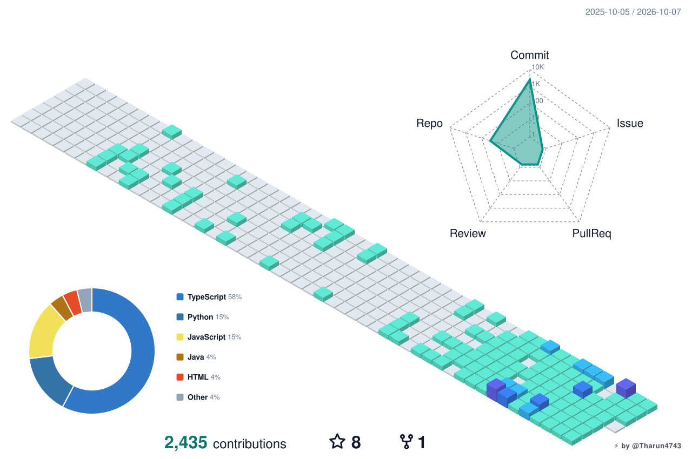
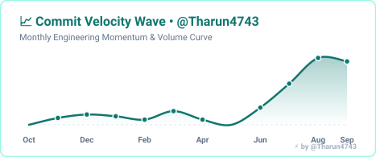
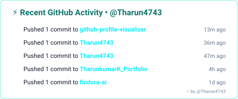
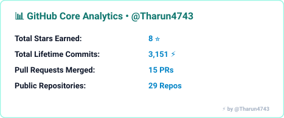
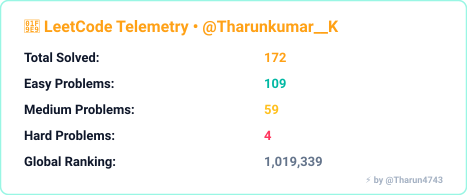

# Hi, I'm Tharunkumar K 👋

### Full Stack Developer & AI Systems Engineer

  
  
  

  <a href="https://tharunkumark4743.netlify.app/">🌐 <b>Portfolio</b></a> ·
  <a href="https://www.linkedin.com/in/tharunkumark4743">💼 <b>LinkedIn</b></a> ·
  <a href="https://leetcode.com/u/Tharunkumar__K/">🧩 <b>LeetCode</b></a> ·
  <a href="mailto:tharunkumark42007@gmail.com">📧 <b>Email</b></a>

---

## ⚡ Highlights

* 🥇 **Winner — Code Thugs 2K26** (1st Place National Hackathon)
* 🚀 **Smart India Hackathon (SIH)** — 2025 & 2026 Top 50 National Finalist
* 🏆 **Odoo × NMIT Bangalore 2026** — National Finalist
* 🌟 **Best GitHub Profile & Top Developer** — VSB Engineering College
* 🎓 **GeeksforGeeks Campus Mantri 2026**

---

## 💻 Featured Projects

* ⚡ **[GitHub Profile Visualizer](https://github.com/marketplace/actions/github-profile-visualizer):** Published GitHub Action & 13-in-1 pure SVG developer telemetry suite.
* 🏛️ **[VSBEC IT Vault](https://github.com/Tharun4743/taskmanager):** Sandboxed compiler & campus governance ecosystem actively used by **365+ students**.
* ⚡ **[GOAT Code Editor](https://github.com/Tharun4743/GOAT-CE):** Real-time collaborative IDE with custom peer-to-peer WebRTC voice mesh (Code Thugs Winner).
* 🔍 **[FINDORA AI](https://github.com/Tharun4743/findora-ai):** Campus lost & found correlation engine with Google Gemini 2.5 Flash (AIML Hackathon 3rd Prize).

---

## 🛠️ Skills

* **Languages:** Java 17, TypeScript, JavaScript, Python, C/C++, SQL
* **Frontend:** React 19, Next.js 15, Vite, Tailwind CSS, Monaco Editor
* **Backend & DB:** Node.js, Express, REST APIs, Socket.IO, PostgreSQL, Supabase, Neon
* **Tools & Cloud:** Docker, Git, GitHub Actions, Google Gemini AI, Cloudinary, Vercel

---

## 📊 Telemetry & Engineering Activity

<!-- Executive Summary (Ocean Light) -->

  

<!-- 3D Contribution Skyline (Ocean Light) -->

  

<!-- Telemetry Grid -->
<table border="0" cellpadding="0" cellspacing="4" align="center" width="100%">
  <tr>
    <td width="50%"></td>
    <td width="50%"></td>
  </tr>
  <tr>
    <td width="50%"></td>
    <td width="50%"></td>
  </tr>
  <tr>
    <td width="50%"></td>
    <td width="50%"></td>
  </tr>
  <tr>
    <td width="50%"></td>
    <td width="50%"></td>
  </tr>
</table>

 

### 🐍 365-Day Contribution Snake

<picture>
  <source media="(prefers-color-scheme: dark)" srcset="assets/github-contribution-grid-snake-dark.svg">
  <source media="(prefers-color-scheme: light)" srcset="assets/github-contribution-grid-snake.svg">
  
</picture>

  

